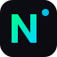

<div align="center">



# NeuraWealth OS

**The World's First Autonomous AI Wealth Engine**

[](https://github.com/fullstackcrypto/neurawealth-os/actions/workflows/ci.yml)
[](https://github.com/fullstackcrypto/neurawealth-os/actions/workflows/deploy.yml)
[](LICENSE)
[](https://www.typescriptlang.org/)
[](https://reactjs.org/)

*AI-powered crypto signals · Automated trading bots · Mining claim intelligence · Revenue automation*

[**Launch App →**](https://fullstackcrypto.github.io/neurawealth-os) &nbsp;|&nbsp;
[Features](#features) &nbsp;|&nbsp;
[Quick Start](#quick-start) &nbsp;|&nbsp;
[Deployment](#deployment) &nbsp;|&nbsp;
[Architecture](#architecture)

</div>

---

## Overview

NeuraWealth OS is a full-stack, AI-powered wealth management platform built for serious crypto traders, miners, and fintech innovators. It combines real-time market intelligence, technical analysis, automated signal delivery, and revenue tracking into a single, stunning "Quantum Noir" dashboard.

> **Design philosophy**: Bloomberg Terminal meets Stripe Dashboard — maximum information density with a cinematic dark aesthetic.

---

## Features

### 📊 AI Signal Engine
Real-time BUY/SELL/HOLD signals for 20+ top crypto pairs powered by:
- **RSI(14)** — Relative Strength Index with overbought/oversold detection
- **EMA 9/21 crossover** — Short and medium-term trend alignment
- **MACD histogram** — Momentum confirmation
- **AI Confidence Score** — Multi-indicator confluence scoring (0–100%)

One-click Telegram signal formatting with emoji-rich output.

### 🤖 Trading Bot Simulator
Paper trading dashboard with:
- Live BTC price feed from CoinGecko
- Three pre-built strategies: Momentum, Mean Reversion, Breakout
- Cumulative P&L chart with 7-day history
- Risk management settings (stop loss, take profit, max daily loss)
- Full trade history log

### 📱 Telegram Intelligence
- Subscriber growth tracking and analytics
- Automated signal delivery pipeline
- Trending topic sentiment analysis (bullish/bearish/neutral)
- Bot command reference and configuration guide

### ⛏️ Mining Claim Intel
- 20 pre-scored US mineral claims with AI scores (0–100)
- Interactive Google Maps integration
- Mineral type, acreage, and status tracking
- Premium claim designation system

### 🛒 AI Marketplace
Six monetizable API services:
- Signal Generation API ($99/mo)
- Sentiment Analysis API ($79/mo)
- Claim Scoring API ($149/mo)
- Content Generation ($49/mo)
- Data Pipeline Automation ($199/mo)
- Custom Bot Development ($999 one-time)

### 💰 Revenue Dashboard
- MRR growth charting (10-month trajectory)
- Revenue breakdown by module (pie chart)
- Subscriber count by tier (bar chart)
- ARR projection and ARPU metrics

### 🔄 Automation Pipeline
Visual data flow diagram showing the complete signal lifecycle from market data ingestion through analysis to Telegram delivery.

---

## Tech Stack

| Layer | Technology |
|-------|------------|
| **Frontend** | React 19, TypeScript 5.6, Vite 7 |
| **UI Components** | shadcn/ui (Radix UI primitives) |
| **Styling** | Tailwind CSS v4, Space Grotesk, JetBrains Mono |
| **Animation** | Framer Motion |
| **Charts** | Recharts |
| **Routing** | Wouter |
| **Forms** | React Hook Form + Zod |
| **Backend** | Express (Node.js static server) |
| **Build** | Vite (client) + esbuild (server) |
| **Package Manager** | pnpm 10 |
| **Data Source** | CoinGecko API (public) |

---

## Quick Start

### Prerequisites

- **Node.js** 20+ ([download](https://nodejs.org/))
- **pnpm** 10+ — `npm install -g pnpm`

### Install & Run

```bash
# Clone the repository
git clone https://github.com/fullstackcrypto/neurawealth-os.git
cd neurawealth-os

# Install dependencies
pnpm install

# Start the development server
pnpm dev
```

Open [http://localhost:3000](http://localhost:3000) in your browser.

### Available Scripts

| Command | Description |
|---------|-------------|
| `pnpm dev` | Start development server with HMR |
| `pnpm build` | Build client + server for production |
| `pnpm start` | Run production server (`dist/index.js`) |
| `pnpm check` | TypeScript type checking |
| `pnpm format` | Format code with Prettier |
| `pnpm preview` | Preview the production build locally |

---

## Environment Variables

Copy `.env.example` to `.env` and configure:

```bash
cp .env.example .env
```

| Variable | Description | Required |
|----------|-------------|----------|
| `VITE_ANALYTICS_ENDPOINT` | Umami analytics server URL | No |
| `VITE_ANALYTICS_WEBSITE_ID` | Umami website tracking ID | No |
| `PORT` | Server port (default: `3000`) | No |
| `NODE_ENV` | `development` or `production` | No |

> **Note**: The app works fully without any environment variables. Analytics are optional.

---

## Architecture

```
neurawealth-os/
├── client/                     # React SPA (Vite)
│   ├── public/                 # Static assets (icons, manifest, SW)
│   └── src/
│       ├── components/         # Shared components (AppLayout, ErrorBoundary)
│       │   └── ui/             # shadcn/ui component library
│       ├── contexts/           # React contexts (ThemeContext)
│       ├── hooks/              # Custom hooks (CoinGecko, animated counters)
│       ├── lib/                # Utilities (technical analysis, mock data)
│       ├── pages/              # Route-level page components
│       └── App.tsx             # Root app with routing
├── server/                     # Express production server
│   └── index.ts                # Static file server with SPA fallback
├── shared/                     # Shared TypeScript constants
│   └── const.ts
├── patches/                    # pnpm dependency patches
├── .github/
│   └── workflows/
│       ├── ci.yml              # Continuous integration (type-check + build)
│       └── deploy.yml          # GitHub Pages deployment
├── package.json
├── vite.config.ts
└── tsconfig.json
```

### Data Flow

```
CoinGecko API → useCoinGecko hook → Technical Analysis Engine → Signal Generation
                                                                        ↓
                                                            Recharts Visualizations
                                                                        ↓
                                                            Telegram Signal Formatter
```

---

## Deployment

### GitHub Pages (Recommended for static hosting)

The repository includes a GitHub Actions workflow for automatic deployment to GitHub Pages on every push to `main`.

**Setup steps:**
1. Go to **Settings → Pages** in your GitHub repository
2. Set **Source** to **GitHub Actions**
3. Push to `main` — the workflow deploys automatically

The static build (`dist/public/`) is a Progressive Web App (PWA) that works offline.

### Self-Hosted (Docker / VPS)

```bash
# Build
pnpm build

# Run production server
NODE_ENV=production PORT=3000 pnpm start
```

Or use the included `server/index.ts` which serves static files from `dist/public/` with SPA routing.

### Environment Considerations

- The app uses the **CoinGecko public API** (free tier). Expect occasional rate limiting with fallback to cached data.
- For production high-frequency use, obtain a [CoinGecko API key](https://www.coingecko.com/en/api) and add it as a query parameter.
- All trading signals are **informational only** — not financial advice.

---

## Progressive Web App

NeuraWealth OS is a fully installable PWA:

- **Service Worker** — offline-capable via `client/public/sw.js`
- **Web App Manifest** — installable on mobile and desktop
- **Icons** — 192×192 and 512×512 PNG icons included
- **Apple Touch Icon** — iOS home screen support
- **Theme Color** — `#0a0a0f` (Quantum Noir)

---

## Design System

**"Quantum Noir Dashboard"** — Luxury Fintech meets Bloomberg Terminal

| Token | Value | Usage |
|-------|-------|-------|
| Background | `#0a0a0f` | Page background |
| Surface | `#0d0d14` | Sidebar, cards |
| Emerald | `#00ff88` | Profit, BUY signals, primary CTAs |
| Cyan | `#00d4ff` | Data, Telegram, secondary actions |
| Amber | `#ffb800` | Warnings, HOLD signals |
| Red | `#ef4444` | Losses, SELL signals |
| Font (Headers) | Space Grotesk 700 | Headings |
| Font (Data) | JetBrains Mono | Numbers, prices |
| Font (Body) | Inter | Body text |

---

## Security

- All external API calls use HTTPS
- Content Security Policy headers set in production server
- No API keys stored client-side
- Input validation via Zod schemas
- `express.static` serves only the `dist/public` directory

---

## Contributing

See [CONTRIBUTING.md](CONTRIBUTING.md) for guidelines on reporting issues, submitting PRs, and the development workflow.

---

## License

MIT © NeuraWealth OS — Created by Charley for Angie

---

<div align="center">
  <sub>Built with ❤️ using React, TypeScript, and Tailwind CSS</sub>
</div>
